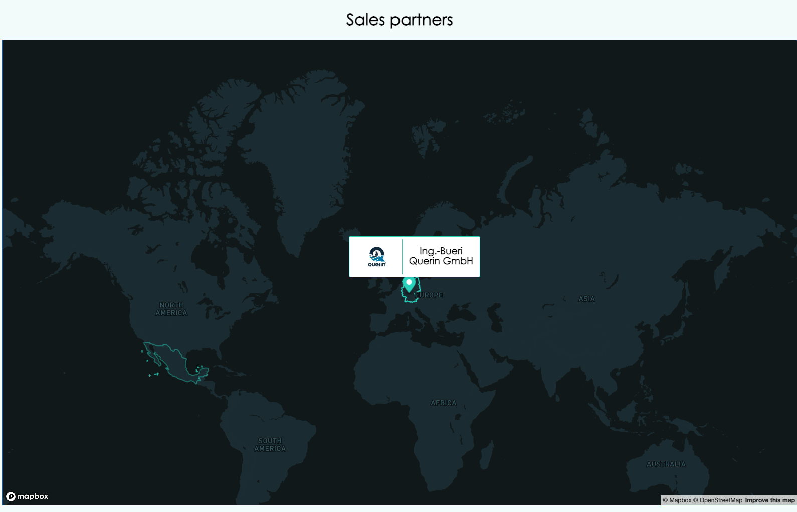

# ScanReach.WebsiteMap

This is a repo for a website map of partners of ScanReach and representatives working for ScanReach

## Image from how the page looks now

## Image from miro on the plan for the page

## Things that still need work:

- [ ] The polygon outline should be highlighted when clicked not just when mouseenter
- [ ] The marker should be removed when the area is no longer selected
- [ ] The marker should be styled as two circles with scanreach colours
- [ ] The popup should be shown on hover ?
- [ ] Need to add geojson file and js file for all parteners
- [ ] Need to add all the logos
- [ ] Need to create the representative map
- [ ] Need to add images, name, email and phonenumber for all representatives
