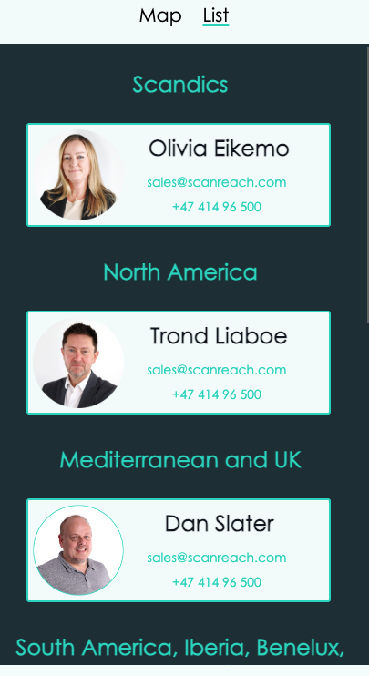

# ScanReach.WebsiteMap

This is a repo for a website map of partners of ScanReach and representatives working for ScanReach. It shows the areas that the partners and representatives each have and is based on what query parameter is entered.

## How the map works

Curently the default parameter is representatives. To show the sales partners instead, remove representatives from the end of the query and enter salespartners instead.

Click once on the map to activate it.

Hovering over, or clicking an area will show a popup with the sales partners logo and link to website, and a marker at the lat long where the partner offices is located.
When showing the representatives part of the map, hovering over, or clicking an area will show a popup with the representatives image, name and the default sales email and phone number. Clicking the email will open the default email on your device and enter scanreach´s default sales email into the to: area. Clicking the phone will give you an option on your device to call that number

A user can choose list instead, this is especially useful on screen sizes smaller then 768px. The list will show all partners or representatives and the area that is their responsibility.

## How to create new geoJson borders

- Open Overpass Turbo
- Use ChatGPT to create a query for the getting the needed borders
- Click RUN
- Verify that correct Borders are marked
- Click Export and copy GeoJson
- Create a file with the name of the country(ies) the border includes
- Install mapshaper `npm install -g mapshaper`
- Run this command `mapshaper borders/your-file.geojson -simplify 5% -o format=geojson borders/your-desired-filename-simplified.geojson`
- Verify the border by running the application with liveserver
- Add the partner or representative to the Js file
- For SalesPartners add lngLat for their HQ

## Screenshots of how the map and list looks dependant on what query is chosen

Salespartners map on desktop

Salespartners map on mobile

Salespartners list on desktop

Salespartners list on mobile

Representative map on desktop

Representative map on mobile

Representative list on desktop

Representative list on mobile

## Image from miro on the plan for the page

## Findings:

- [ ] Should the polygon go back to its default opacity when another area is clicked?
